+++
date = '2026-05-06T10:00:00+08:00'
draft = false
title = 'UE5 Virtual Texture 与 Runtime Virtual Texture 源码级全流程解析'
tags = ['UE5', 'VirtualTexture', 'RVT', 'SVT', 'Terrain', 'SourceCode']
categories = ['图形渲染']
+++

> 本文基于 UE 5.x 引擎源码 `Engine/Source/Runtime/Renderer/Private/VT/` 及 `Engine/Source/Runtime/Engine/Private/VT/`，从源码层面深入解析 Virtual Texture 系统的完整管线。所有代码引用均标注了引擎内的原始路径。

---

## 0. 一分钟看懂 VT/RVT

想象你在看一张超大的世界地图（比如 16K×16K 的地形贴图），但屏幕只有 1080p——你不可能也没必要把整张地图都装进显存。UE 的 Virtual Texture 就是解决这个问题的：

**核心思路 = 操作系统的虚拟内存搬到了 GPU 上：**

- **虚拟地址空间**（PageTable 纹理）：一张很小的查找表，记录"地图的这块区域对应物理内存的哪个位置"
- **物理内存**（PhysicalCache）：实际存放贴图像素的地方，只有当前屏幕上能看到的那几块（Page）才会加载进来
- **缺页中断**（FeedbackBuffer）：屏幕上画到某个像素时，发现对应的贴图块还没加载，就写一条"我需要这块"的反馈
- **LRU 淘汰**：物理内存满了就把最久没看的块扔掉，腾位置给新的

**SVT vs RVT 的区别：**

| | SVT（Streaming Virtual Texture） | RVT（Runtime Virtual Texture） |
|---|---|---|
| 数据来源 | 磁盘上的离线贴图文件 | 运行时实时渲染（材质画到 VT 上） |
| 典型场景 | 大贴图直接转 VT 流式加载 | 地形材质混合、地表装饰层 |
| 加载方式 | 异步 IO → 转码 → 上传到物理页 | 每帧渲染需要的 Page（画一个小方格） |

**RVT 的巧妙设计——低 Mip 用 SVT 兜底：**

RVT 的近距离（高 Mip）需要实时渲染，但远距离（低 Mip）的细节在离线时就已经确定了。所以 RVT 把低 Mip 重定向到一张预构建的 SVT 上，这样远处直接读磁盘数据，不浪费每帧的渲染算力。

**每帧发生了什么（极简版）：**

1. **GPU 画像素时**，采样 VT → 发现某块没加载 → 写一条反馈到 FeedbackBuffer
2. **CPU 读回反馈** → 去重 → 查"这块已经在物理内存了吗？" → 如果不在，创建加载请求
3. **执行请求**：SVT 从磁盘读，RVT 实时渲染一个小方格 → 写入物理内存
4. **更新 PageTable**：告诉 GPU "这块现在在物理内存的哪个位置"

下面进入源码级的详细解析。

---

## 1. 宏观架构：GPU 上的虚拟内存系统

UE 的 VT 体系本质是将操作系统的虚拟内存思想搬到 GPU 纹理管理上：

| OS 虚拟内存 | UE Virtual Texture |
|---|---|
| 虚拟地址空间 | `FVirtualTextureSpace`（PageTable 纹理） |
| 物理内存 | PhysicalCache（实际纹理池） |
| 页表 | `FTexturePageMap`（CPU 端）+ PageTable 纹理（GPU 端） |
| 缺页中断 | FeedbackBuffer → Request → Bake/Load |
| LRU 淘汰 | 最小堆，Key = 帧号 + MipLevel |

**核心类关系**：

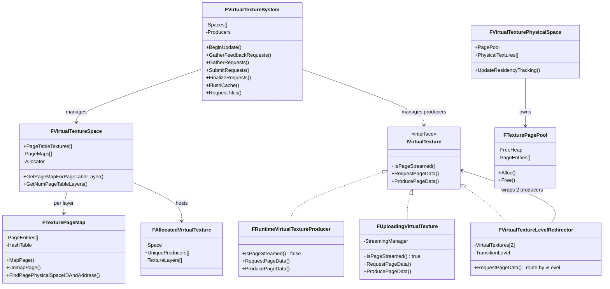
```mermaid
classDiagram
    class FVirtualTextureSystem {
        +BeginUpdate()
        +GatherFeedbackRequests()
        +GatherRequests()
        +SubmitRequests()
        +FinalizeRequests()
        +FlushCache()
        +RequestTiles()
        -Spaces[]
        -Producers
    }

    class FVirtualTextureSpace {
        +PageTableTextures[]
        +GetPageMapForPageTableLayer()
        +GetNumPageTableLayers()
        -PageMaps[]
        -Allocator
    }

    class FTexturePageMap {
        +MapPage()
        +UnmapPage()
        +FindPagePhysicalSpaceIDAndAddress()
        -PageEntries[]
        -HashTable
    }

    class FVirtualTexturePhysicalSpace {
        +PagePool
        +PhysicalTextures[]
        +UpdateResidencyTracking()
    }

    class FTexturePagePool {
        +Alloc()
        +Free()
        -FreeHeap
        -PageEntries[]
    }

    class IVirtualTexture {
        <<interface>>
        +IsPageStreamed()
        +RequestPageData()
        +ProducePageData()
    }

    class FRuntimeVirtualTextureProducer {
        +IsPageStreamed() false
        +RequestPageData()
        +ProducePageData()
    }

    class FUploadingVirtualTexture {
        +IsPageStreamed() true
        +RequestPageData()
        +ProducePageData()
        -StreamingManager
    }

    class FVirtualTextureLevelRedirector {
        -VirtualTextures[2]
        -TransitionLevel
        +RequestPageData() route by vLevel
    }

    class FAllocatedVirtualTexture {
        +Space
        +UniqueProducers[]
        +TextureLayers[]
    }

    FVirtualTextureSystem --> FVirtualTextureSpace : manages
    FVirtualTextureSystem --> IVirtualTexture : manages producers
    FVirtualTextureSpace --> FTexturePageMap : per layer
    FVirtualTextureSpace --> FAllocatedVirtualTexture : hosts
    FVirtualTexturePhysicalSpace --> FTexturePagePool : owns
    IVirtualTexture <|.. FRuntimeVirtualTextureProducer
    IVirtualTexture <|.. FUploadingVirtualTexture
    IVirtualTexture <|.. FVirtualTextureLevelRedirector
    FVirtualTextureLevelRedirector --> IVirtualTexture : wraps 2 producers
```

---

## 2. 每帧管线全流程

VT 系统的每帧更新由 `FVirtualTextureSystem::Update()` 驱动，分为 **BeginUpdate** 和 **EndUpdate** 两个阶段：

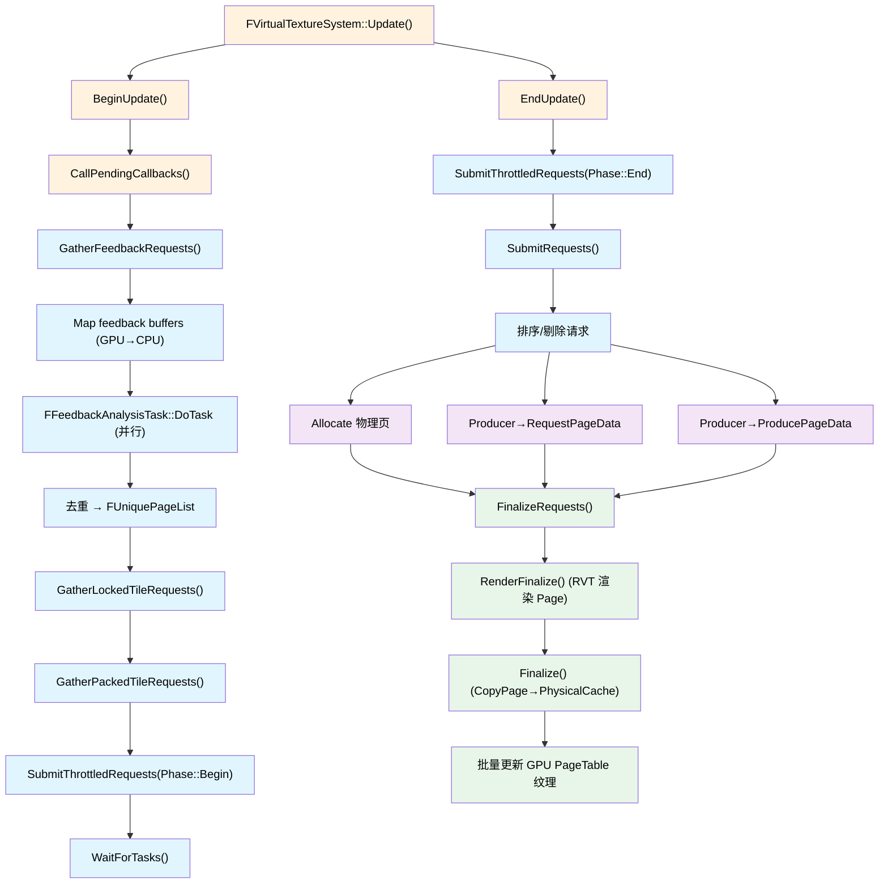
```mermaid
flowchart TD
    A["FVirtualTextureSystem::Update()"] --> B["BeginUpdate()"]
    B --> C["CallPendingCallbacks()"]
    C --> D["GatherFeedbackRequests()"]
    D --> D1["Map feedback buffers (GPU→CPU)"]
    D1 --> D2["FFeedbackAnalysisTask::DoTask (并行)"]
    D2 --> D3["去重 → FUniquePageList"]
    D3 --> E["GatherLockedTileRequests()"]
    E --> F["GatherPackedTileRequests()"]
    F --> G["SubmitThrottledRequests(Phase::Begin)"]
    G --> H["WaitForTasks()"]

    A --> I["EndUpdate()"]
    I --> J["SubmitThrottledRequests(Phase::End)"]
    J --> K["SubmitRequests()"]
    K --> K1["排序/剔除请求"]
    K1 --> K2["Allocate 物理页"]
    K1 --> K3["Producer→RequestPageData"]
    K1 --> K4["Producer→ProducePageData"]
    K2 --> L["FinalizeRequests()"]
    K3 --> L
    K4 --> L
    L --> L1["RenderFinalize() (RVT 渲染 Page)"]
    L1 --> L2["Finalize() (CopyPage→PhysicalCache)"]
    L2 --> L3["批量更新 GPU PageTable 纹理"]

    classDef proc fill:#e1f5fe,color:#000
    classDef dec fill:#fff9c4,color:#000
    classDef data fill:#fff3e0,color:#000
    classDef ok fill:#e8f5e9,color:#000
    classDef out fill:#f3e5f5,color:#000
    class A,B,C,I data
    class D,D1,D2,D3 proc
    class E,F,G,H proc
    class J,K,K1 proc
    class K2,K3,K4 out
    class L,L1,L2,L3 ok
```

---

## 3. 阶段一：GPU 端产生 Feedback

### 3.1 采样与写入

材质中的 **RVT Output 节点**在 PixelShader 中做两件事：

1. **采样 RVT**：调用 `TextureLoadVirtualPageTable` 计算当前像素的 Page 信息
2. **写入 Feedback**：在 PS 末尾通过 `FinalizeVirtualTexturefeedback` 把请求写入 `VirtualTexture_FeedbackBuffer`

对应 Shader 代码位于 `VirtualTextureCommon.ush`。

### 3.2 FeedbackBuffer 数据格式

每个元素为 `uint32`，位域布局如下：

```
┌──────────────────────────────────────────────────────────┐
│ Bit 31-28  │ Bit 27-24  │    Bit 23-12   │  Bit 11-0    │
│ SpaceID    │ Level+1    │    PageY       │  PageX       │
└──────────────────────────────────────────────────────────┘
```

| 位段 | 含义 |
|---|---|
| 0–11 | PageX — 虚拟页的 X 坐标 |
| 12–23 | PageY — 虚拟页的 Y 坐标 |
| 24–27 | Level+1（+1 是因为 0 表示"无效/无请求"） |
| 28–31 | PageTableFeedbackId（SpaceID，标识映射到哪个 VT） |

### 3.3 轮询机制

**一个像素一次只能为一个 VT 申请一个 Page**。如果像素采样了多个 RVT，则采取轮询（round-robin）机制：

- 相邻多个像素共享同一个 Buffer 元素
- 不同像素和不同帧会存储不同 VT 的请求
- 在时域和空域上做轮询，确保多个 VT 都能被反馈到

### 3.4 GPU→CPU 回读

`FVirtualTextureFeedback` 管理回读管线（`VirtualTextureFeedback.h`）：

- 维护最多 **8 个 pending 传输** 的环形缓冲区
- 使用 **GPU Fence** 追踪完成状态，无需阻塞等待
- `CanMap()` 轮询 Fence，`Map()/Unmap()` 循环使用 Staging Buffer
- 回读延迟由 CVar `GVirtualTextureFeedbackLatency` 控制，默认约 3 帧

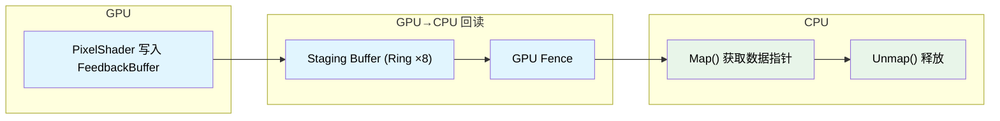
```mermaid
flowchart LR
    subgraph GPU
        PS["PixelShader 写入 FeedbackBuffer"]
    end
    subgraph "GPU→CPU 回读"
        SB["Staging Buffer (Ring ×8)"]
        F["GPU Fence"]
    end
    subgraph CPU
        M["Map() 获取数据指针"]
        UM["Unmap() 释放"]
    end
    PS --> SB --> F --> M --> UM

    classDef data fill:#e1f5fe,color:#000
    classDef ok fill:#e8f5e9,color:#000
    class PS data
    class SB,F data
    class M,UM ok
```

### 3.5 自定义 FeedbackBuffer

可通过 `SubmitVirtualTextureFeedbackBuffer` 使用自定义的 FeedbackBuffer，参考 `VirtualHeightfieldMeshSceneProxy.cpp`。Shader 端构造 Feedback 数据参考 `VirtualHeightfieldMesh.usf`。

---

## 4. 阶段二：解析 Feedback → 构建请求

### 4.1 GatherFeedbackRequests：去重

`FVirtualTextureSystem::GatherFeedbackRequests()` 执行流程：

1. 将整个 FeedbackBuffer 回读到 CPU
2. 切分成多个并行任务执行 `FFeedbackAnalysisTask::DoTask`
3. Task 内对 Feedback **去重**，构成 `FUniquePageList`

**FUniquePageList**（`UniquePageList.h`）：

- 固定 16K 哈希桶，最多 8K 唯一页
- 存储每个页的 PageId 和 AccessCount
- `MergePages()` 合并多个列表

### 4.2 GatherRequests：查找与创建请求

`FVirtualTextureSystem::GatherRequests()` 遍历 `UniquePageList`，对每个 Page：

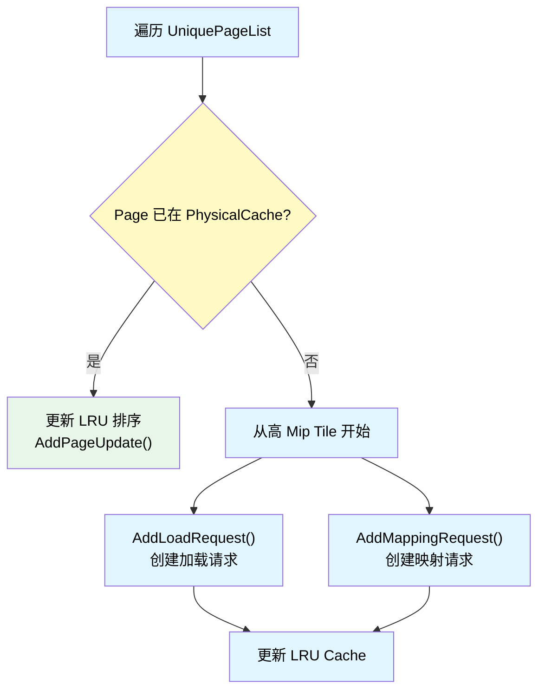
```mermaid
flowchart TD
    A["遍历 UniquePageList"] --> B{"Page 已在 PhysicalCache?"}
    B -->|是| C["更新 LRU 排序\nAddPageUpdate()"]
    B -->|否| D["从高 Mip Tile 开始"]
    D --> E["AddLoadRequest()\n创建加载请求"]
    D --> F["AddMappingRequest()\n创建映射请求"]
    E --> G["更新 LRU Cache"]
    F --> G

    classDef proc fill:#e1f5fe,color:#000
    classDef dec fill:#fff9c4,color:#000
    classDef ok fill:#e8f5e9,color:#000
    class A proc
    class B dec
    class C ok
    class D,E,F,G proc
```

**查找 Page 是否存在**的核心代码（`FTexturePageMap::FindPagePhysicalSpaceIDAndAddress`）：

```cpp
// VirtualTextureSpace.h
for (uint32 PageTableLayerIndex = 0u; PageTableLayerIndex < Space->GetNumPageTableLayers(); ++PageTableLayerIndex)
{
    const FTexturePageMap& PageMap = Space->GetPageMapForPageTableLayer(PageTableLayerIndex);
    const FPhysicalSpaceIDAndAddress PhysicalSpaceIDAndAddress =
        PageMap.FindPagePhysicalSpaceIDAndAddress(VirtualPage, VirtualPageHash);
    if (PhysicalSpaceIDAndAddress.Packed != ~0u)
    {
        // Page 已存在于 PhysicalCache
    }
}
```

### 4.3 LRU 淘汰策略

`FTexturePagePool` 使用**最小堆**（`FreeHeap`）管理物理页淘汰：

| Key 组成 | 淘汰优先级 |
|---|---|
| 帧号越小 | 越早淘汰（上次访问越久远） |
| MipLevel 越小 | 越早淘汰（越粗糙的 mip 优先让位） |

淘汰流程（`FTexturePagePool::Alloc`）：

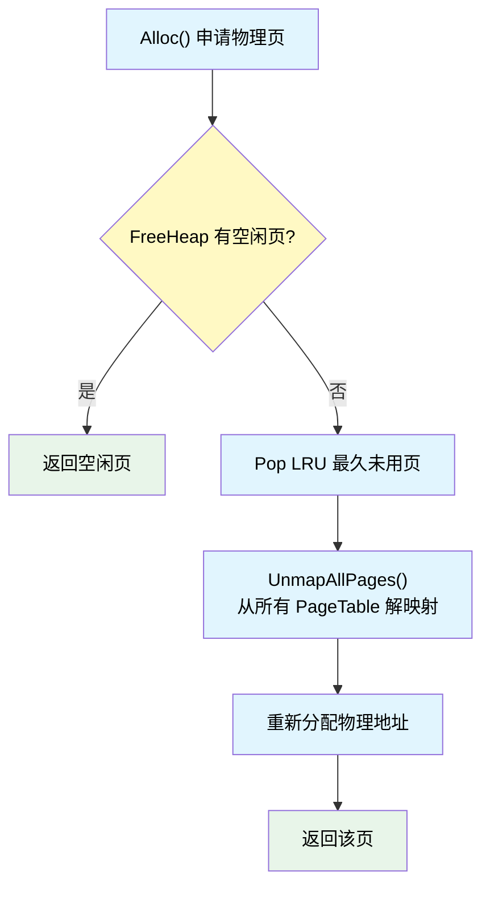
```mermaid
flowchart TD
    A["Alloc() 申请物理页"] --> B{"FreeHeap 有空闲页?"}
    B -->|是| C["返回空闲页"]
    B -->|否| D["Pop LRU 最久未用页"]
    D --> E["UnmapAllPages()
从所有 PageTable 解映射"]
    E --> F["重新分配物理地址"]
    F --> G["返回该页"]

    classDef proc fill:#e1f5fe,color:#000
    classDef dec fill:#fff9c4,color:#000
    classDef ok fill:#e8f5e9,color:#000
    class A proc
    class B dec
    class C,G ok
    class D,E,F proc
```

### 4.4 请求合并与排序

**FUniqueRequestList**（`UniqueRequestList.h`）管理多种请求类型：

| 请求类型数组 | 容量 | 说明 |
|---|---|---|
| LoadRequests | 4K | 加载新页 |
| MappingRequests | ~7.75K | 虚拟→物理映射 |
| DirectMappingRequests | — | 直接映射 |
| ContinuousUpdateRequests | — | 持续更新 |
| AdaptiveAllocationRequests | — | Adaptive 分配 |

**排序优先级**（`SortRequests`）：

1. **Locked 请求**（最高优先级，永不被淘汰）
2. **Streaming 请求**（上限 `MaxStreamingLoadRequests`）
3. **Non-Streaming 请求**（上限 `MaxNonStreamingLoadRequests`）
4. 按 `(AccessCount * (1 + mipLevel))` 加权排序
5. 按 `EVTProducerPriority` 枚举排序

---

## 5. 阶段三：SubmitRequests — 执行请求

`FVirtualTextureSystem::SubmitRequests()` 遍历 RequestList 的每个 PageRequest：

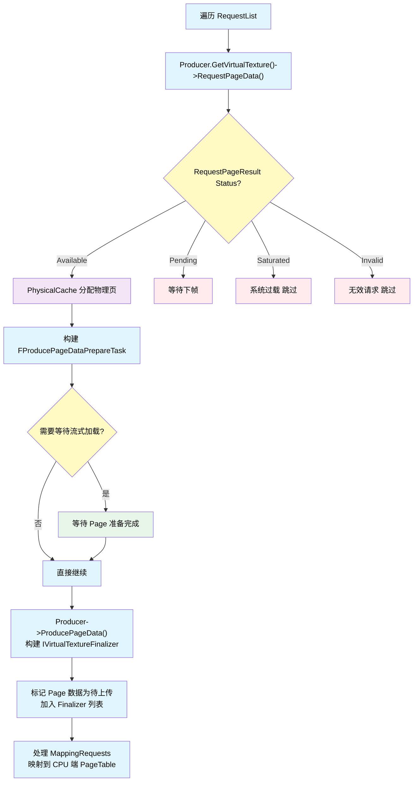
```mermaid
flowchart TD
    A["遍历 RequestList"] --> B["Producer.GetVirtualTexture()->RequestPageData()"]
    B --> C{"RequestPageResult Status?"}
    C -->|Available| D["PhysicalCache 分配物理页"]
    C -->|Pending| E["等待下帧"]
    C -->|Saturated| F["系统过载 跳过"]
    C -->|Invalid| G["无效请求 跳过"]
    D --> H["构建 FProducePageDataPrepareTask"]
    H --> I{"需要等待流式加载?"}
    I -->|是| J["等待 Page 准备完成"]
    I -->|否| K["直接继续"]
    J --> K
    K --> L["Producer->ProducePageData()
构建 IVirtualTextureFinalizer"]
    L --> M["标记 Page 数据为待上传
加入 Finalizer 列表"]
    M --> N["处理 MappingRequests
映射到 CPU 端 PageTable"]

    classDef proc fill:#e1f5fe,color:#000
    classDef dec fill:#fff9c4,color:#000
    classDef ok fill:#e8f5e9,color:#000
    classDef err fill:#ffebee,color:#000
    classDef out fill:#f3e5f5,color:#000
    class A,B,H,K,L,M,N proc
    class C dec
    class D out
    class E,F,G err
    class I dec
    class J ok
```

### RVT vs SVT 的 RequestPageData 行为对比

| | FRuntimeVirtualTextureProducer | FUploadingVirtualTexture |
|---|---|---|
| `IsPageStreamed()` | 返回 `false`（运行时生成） | 返回 `true`（磁盘流式加载） |
| `RequestPageData()` | 检查场景就绪状态，返回 Available/Saturated | 检查 TranscodeCache，创建异步 IO 任务 |
| `ProducePageData()` | 队列 Page 到 Finalizer 等待渲染 | 标记数据待上传，加入 PendingSubmit |

### SVT 的异步加载流程

`FUploadingVirtualTexture` 的 `RequestPageData` 流程：

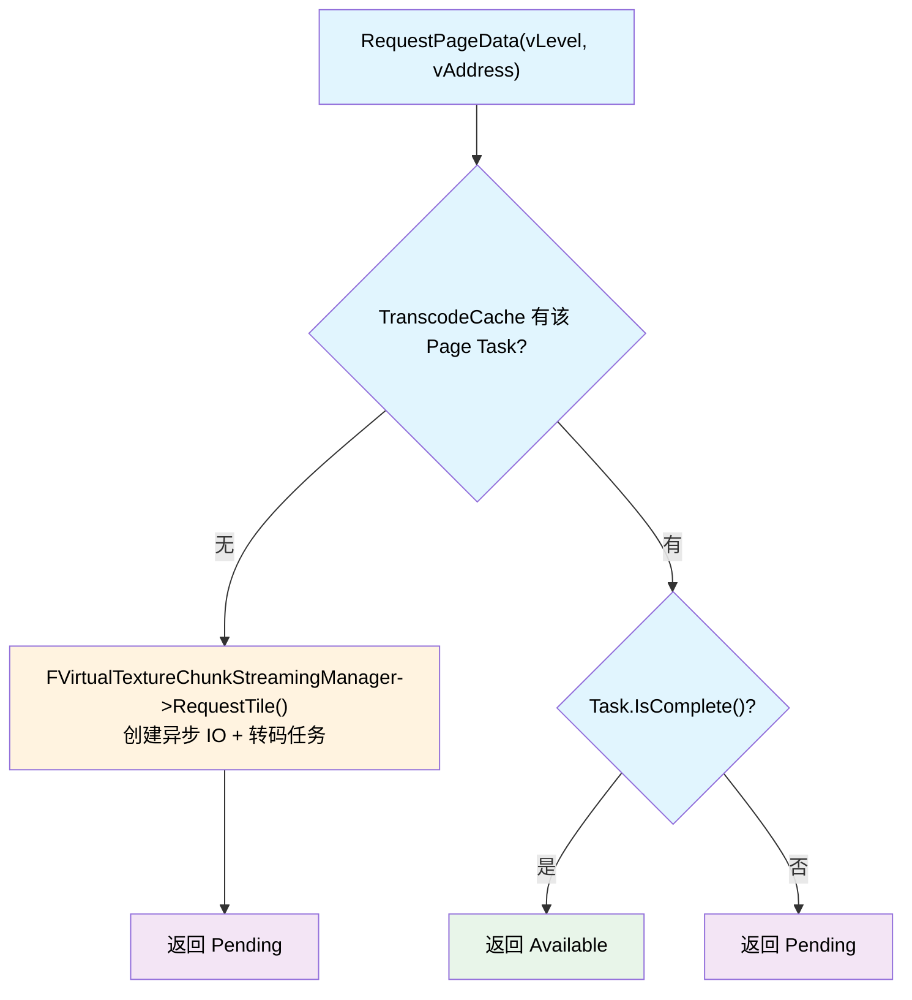
```mermaid
flowchart TD
    A["RequestPageData(vLevel, vAddress)"] --> B{"TranscodeCache 有该 Page Task?"}
    B -->|无| C["FVirtualTextureChunkStreamingManager->RequestTile()
创建异步 IO + 转码任务"]
    C --> D["返回 Pending"]
    B -->|有| E{"Task.IsComplete()?"}
    E -->|是| F["返回 Available"]
    E -->|否| G["返回 Pending"]

    classDef proc fill:#e1f5fe,color:#000
    classDef dec fill:#fff9c4,color:#000
    classDef data fill:#fff3e0,color:#000
    classDef ok fill:#e8f5e9,color:#000
    classDef out fill:#f3e5f5,color:#000
    class A,B,E proc
    class C data
    class D,G out
    class F ok
```

`FUploadingVirtualTexture` 的 `ProducePageData` 流程：

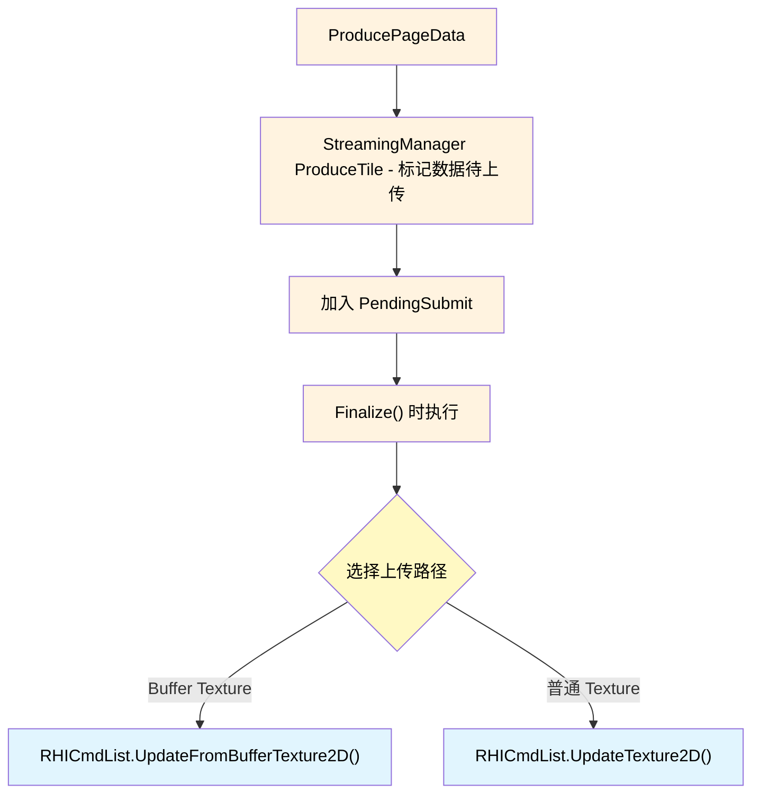
```mermaid
flowchart TD
    A["ProducePageData"] --> B["StreamingManager ProduceTile - 标记数据待上传"]
    B --> C["加入 PendingSubmit"]
    C --> D["Finalize() 时执行"]
    D --> E{"选择上传路径"}
    E -->|"Buffer Texture"| F["RHICmdList.UpdateFromBufferTexture2D()"]
    E -->|"普通 Texture"| G["RHICmdList.UpdateTexture2D()"]

    classDef proc fill:#e1f5fe,color:#000
    classDef dec fill:#fff9c4,color:#000
    classDef data fill:#fff3e0,color:#000
    class A,B,C,D data
    class E dec
    class F,G proc
```

**截帧可见**：SVT Page 的实际加载路径是 CPU Write → Fast Allocator Page → CopyTextureRegion → PhysicalPages，而非 Runtime Generate Page。

---

## 6. 阶段四：FinalizeRequests — 渲染与上传

`FVirtualTextureSystem::FinalizeRequests()` 是最终的渲染与同步阶段：

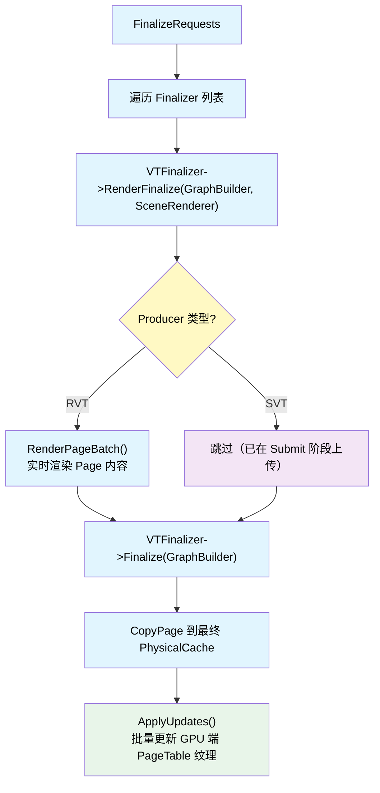
```mermaid
flowchart TD
    A["FinalizeRequests"] --> B["遍历 Finalizer 列表"]
    B --> C["VTFinalizer->RenderFinalize(GraphBuilder, SceneRenderer)"]
    C --> C1{"Producer 类型?"}
    C1 -->|"RVT"| C2["RenderPageBatch()
实时渲染 Page 内容"]
    C1 -->|"SVT"| C3["跳过（已在 Submit 阶段上传）"]
    C2 --> D["VTFinalizer->Finalize(GraphBuilder)"]
    C3 --> D
    D --> D1["CopyPage 到最终 PhysicalCache"]
    D1 --> E["ApplyUpdates()
批量更新 GPU 端 PageTable 纹理"]

    classDef proc fill:#e1f5fe,color:#000
    classDef dec fill:#fff9c4,color:#000
    classDef ok fill:#e8f5e9,color:#000
    classDef out fill:#f3e5f5,color:#000
    class A,B,C,C2,D,D1 proc
    class C1 dec
    class C3 out
    class E ok
```

### RVT Page 渲染细节

`FRuntimeVirtualTextureFinalizer`（`RuntimeVirtualTextureProducer.h`）负责 RVT 的 Page 渲染：

**RenderFinalize** 阶段设置多个 Render Pass：

1. **几何渲染 Pass** — 用材质渲染 Page 对应的几何体到临时 RT
2. **压缩 Pass** — 将渲染结果通过 Compute Shader 压缩为 BC/ETC2 格式
3. **Copy Pass** — 拷贝到最终的 PhysicalTexture

**支持的材质类型**（`ERuntimeVirtualTextureMaterialType`）：

| 类型 | 层数 | 像素格式 |
|---|---|---|
| BaseColor | 1 | DXT1 / B8G8R8A8 |
| BaseColor_Normal_Roughness | 2 | DXT1 + DXT5 |
| BaseColor_Normal_Specular | 2 | DXT1 + DXT5 |
| BaseColor_Normal_Specular_YCoCg | 2 | DXT1 + DXT5 |
| Mask4 | 1 | R8G8B8A8 |
| WorldHeight | 1 | G16 |
| Displacement | 1 | BC4 / G16 |

### PageTable 更新渲染

PageTable 的更新不是逐像素写入，而是通过**几何渲染**批量完成。两种扩展策略：

**1. ExpandPageTableUpdatePainters** — 画家算法

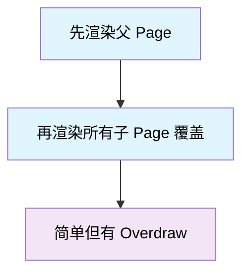
```mermaid
flowchart TD
    A["先渲染父 Page"] --> B["再渲染所有子 Page 覆盖"]
    B --> C["简单但有 Overdraw"]

    classDef proc fill:#e1f5fe,color:#000
    classDef out fill:#f3e5f5,color:#000
    class A,B proc
    class C out
```

**2. ExpandPageTableUpdateMasked** — 四叉树分割 + 遮罩

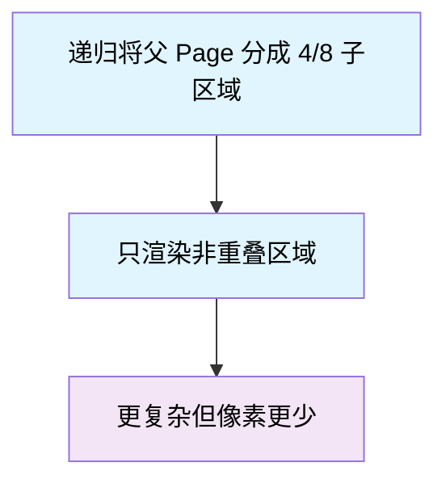
```mermaid
flowchart TD
    A["递归将父 Page 分成 4/8 子区域"] --> B["只渲染非重叠区域"]
    B --> C["更复杂但像素更少"]

    classDef proc fill:#e1f5fe,color:#000
    classDef out fill:#f3e5f5,color:#000
    class A,B proc
    class C out
```

对应 Shader 位于 `PageTableUpdate.usf`，以 Quad 实例化方式渲染，Vertex Shader 生成 Quad 位置，Pixel Shader 写入 `(vAddress, pAddress)` 到 PageTable 纹理。

---

## 7. 核心概念详解

### 7.1 FVirtualTextureSpace — 虚存地址空间

**文件**：`VirtualTextureSpace.h/cpp`

`FVirtualTextureSpace` 是整个 VT 系统的地址空间管理核心：

```
┌─────────────────────────────────────────────┐
│            FVirtualTextureSpace              │
│                                              │
│  ┌─────────────────────────────────────┐     │
│  │  CPU 端: FTexturePageMap[]          │     │
│  │  (每 Layer 一份 virtual→physical)    │     │
│  └─────────────────────────────────────┘     │
│                                              │
│  ┌─────────────────────────────────────┐     │
│  │  GPU 端: PageTable 纹理数组          │     │
│  │  (每 mip 一张纹理)                   │     │
│  └─────────────────────────────────────┘     │
│                                              │
│  ┌─────────────────────────────────────┐     │
│  │  FVirtualTextureAllocator           │     │
│  │  (四叉树/八叉树地址分配)              │     │
│  └─────────────────────────────────────┘     │
│                                              │
│  一个 Space 可给多个 VTProducer 共用          │
│  每个 Producer 占 vAddress 上的一个 Block     │
└─────────────────────────────────────────────┘
```

**关键属性**：

| 属性 | 说明 |
|---|---|
| 最大地址空间 | 4096×4096 页 (`VIRTUALTEXTURE_MAX_PAGETABLE_SIZE`) |
| 虚拟 Tile 尺寸 | 64/128/256/512 像素（可配置） |
| Border 尺寸 | 4px（用于双线性过滤） |
| 最大 PageTable Mip | 12 层（log2(4096) + 1） |

### 7.2 FTexturePageMap — Virtual→Physical 映射

**文件**：`TexturePageMap.h/cpp`

管理 Single Layer 的 VT Page Table，包含三个链表：

| 链表头 | 含义 |
|---|---|
| `PageListHead_Free` (0) | 空闲页 |
| `PageListHead_Mapped` (1) | 已映射页 |
| `PageListHead_Unmapped` (2) | 已解映射页（需回退到父 Mip） |

**PageEntry 结构**：

```
┌──────────────────────────────────────────────────────┐
│ FTexturePage Page    │ vAddress:24 │ vLogSize:8      │
├──────────────────────┼───────────────────────────────┤
│ PackedProducerHandle │ 哪个 Producer 拥有此页         │
├──────────────────────┼───────────────────────────────┤
│ pAddress:16          │ 物理页地址                      │
│ PhysicalSpaceID:8    │ 哪个 PhysicalSpace              │
│ MaxLevel:4           │ 该页可映射的最大 Mip             │
│ Local_vLevel:4       │ Producer 内部的 Mip 层级        │
└──────────────────────────────────────────────────────┘
```

**关键方法**：

- `MapPage()` — 添加新的 virtual→physical 映射，加入 PageTable 更新队列
- `UnmapPage()` — 移除映射，将祖先页加入回退纹理队列
- `FindPagePhysicalSpaceIDAndAddress()` — O(1) 哈希查找，带碰撞解决
- `FindNearestPageAddress()` — 向上遍历 Mip 层级查找回退页

**同一 VirtualTextureSpace 的不同 Layer 可能映射到不同物理空间，同一虚拟地址在不同 Layer 映射到不同物理地址**。

### 7.3 FAllocatedVirtualTexture — 已分配的 VT

**文件**：`AllocatedVirtualTexture.h/cpp`

代表一个已注册并分配了虚拟地址的 VT，包含：

```cpp
// AllocatedVirtualTexture.h
FVirtualTextureSpace* Space;              // 所属虚拟地址空间
TArray<FProducerDesc> UniqueProducers;    // 使用的 Producer 列表
TArray<FPageTableLayerDesc> UniquePageTableLayers; // 每物理组一个
TextureLayers[MAX_LAYERS];                // 每层映射信息
uint32 PersistentHash;                    // 持久化 ID 映射
```

### 7.4 FTexturePagePool — 物理页池

**文件**：`TexturePagePool.h/cpp`

管理 PhysicalCache 中的页分配与淘汰：

```cpp
struct FPageEntry {
    uint32 PackedProducerHandle;  // 拥有此页的 Producer
    uint32 Local_vAddress:24;     // Producer 内的虚拟地址
    uint32 Local_vLevel:4;        // Producer 内的 Mip 层级
    uint32 GroupIndex:4;          // Producer 的物理组索引
};
```

**关键限制**：

| 参数 | 值 |
|---|---|
| 最大物理页数 | 65535（16-bit 寻址） |
| 每平台最大池大小 | 1024–4096 tiles |
| 每物理空间最大层数 | 4 |

---

## 8. RVT 如何在低 Mip 使用 SVT

这是 RVT 最核心的设计：**高 Mip 实时渲染，低 Mip 离线数据**。

### 8.1 三个关键类

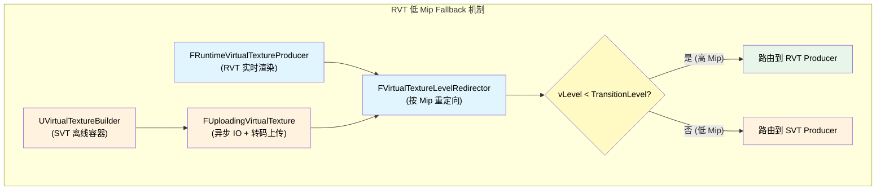
```mermaid
flowchart TD
    subgraph RVT_Fallback["RVT 低 Mip Fallback 机制"]
        A["UVirtualTextureBuilder
(SVT 离线容器)"] --> B["FUploadingVirtualTexture
(异步 IO + 转码上传)"]
        C["FRuntimeVirtualTextureProducer
(RVT 实时渲染)"] --> D["FVirtualTextureLevelRedirector
(按 Mip 重定向)"]
        B --> D
        D --> E{"vLevel < TransitionLevel?"}
        E -->|"是 (高 Mip)"| F["路由到 RVT Producer"]
        E -->|"否 (低 Mip)"| G["路由到 SVT Producer"]
    end

    classDef proc fill:#e1f5fe,color:#000
    classDef dec fill:#fff9c4,color:#000
    classDef ok fill:#e8f5e9,color:#000
    classDef data fill:#fff3e0,color:#000
    class A,B data
    class C,D proc
    class E dec
    class F ok
    class G data
```

### 8.2 FVirtualTextureLevelRedirector

**文件**：`Engine/Private/VT/VirtualTextureLevelRedirector.h/cpp`

路由逻辑非常简洁——根据 Mip 层级选择 Producer：

```cpp
// VirtualTextureLevelRedirector.cpp
bool IsPageStreamed(uint8 vLevel, uint32 vAddress)
{
    const int32 Index = vLevel < TransitionLevel ? 0 : 1;
    const int32 LevelOffset = vLevel < TransitionLevel ? 0 : TransitionLevel;
    return VirtualTextures[Index]->IsPageStreamed(vLevel - LevelOffset, vAddress);
}

FVTRequestPageResult RequestPageData(...)
{
    int32 Index = vLevel < TransitionLevel ? 0 : 1;
    int32 LevelOffset = vLevel < TransitionLevel ? 0 : TransitionLevel;
    return VirtualTextures[Index]->RequestPageData(..., vLevel - LevelOffset, ...);
}
```

### 8.3 构建时机

在 `FRuntimeVirtualTextureSceneProxy` 构造函数中完成绑定：

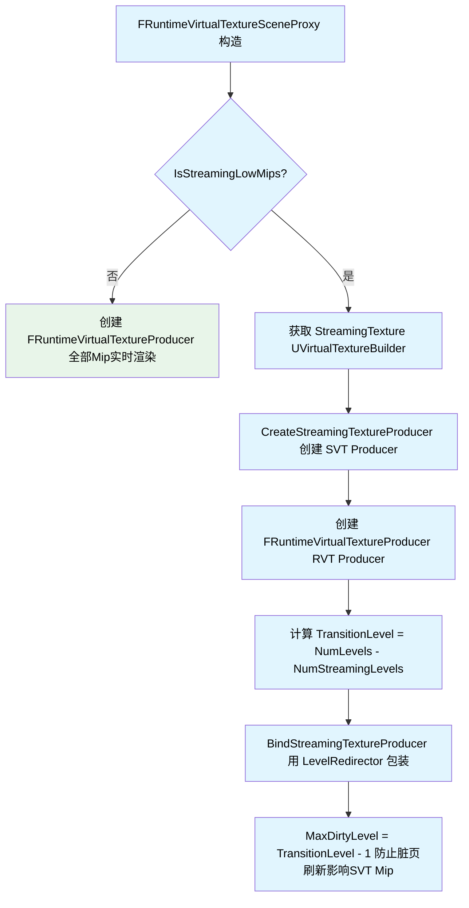
```mermaid
flowchart TD
    A["FRuntimeVirtualTextureSceneProxy 构造"] --> B{"IsStreamingLowMips?"}
    B -->|否| C["创建 FRuntimeVirtualTextureProducer 全部Mip实时渲染"]
    B -->|是| D["获取 StreamingTexture UVirtualTextureBuilder"]
    D --> E["CreateStreamingTextureProducer 创建 SVT Producer"]
    E --> F["创建 FRuntimeVirtualTextureProducer RVT Producer"]
    F --> G["计算 TransitionLevel = NumLevels - NumStreamingLevels"]
    G --> H["BindStreamingTextureProducer 用 LevelRedirector 包装"]
    H --> I["MaxDirtyLevel = TransitionLevel - 1 防止脏页刷新影响SVT Mip"]

    classDef proc fill:#e1f5fe,color:#000
    classDef dec fill:#fff9c4,color:#000
    classDef ok fill:#e8f5e9,color:#000
    class A,B proc
    class C ok
    class D,E,F,G,H,I proc
```

**TransitionLevel 计算**（`RuntimeVirtualTextureSceneProxy.cpp`）：

```cpp
const int32 NumLevels = CeilLogTwo(Max(BlockWidthInTiles, BlockHeightInTiles));
const int32 NumStreamingLevels = CeilLogTwo(Max(StreamingProducerDesc.BlockWidthInTiles,
                                                 StreamingProducerDesc.BlockHeightInTiles));
const int32 TransitionLevel = NumLevels - NumStreamingLevels;
MaxDirtyLevel = TransitionLevel - 1; // 脏页刷新不触及 SVT 区域
```

### 8.4 FUploadingVirtualTexture — SVT 的加载路径

**文件**：`Engine/Private/VT/UploadingVirtualTexture.h/cpp`

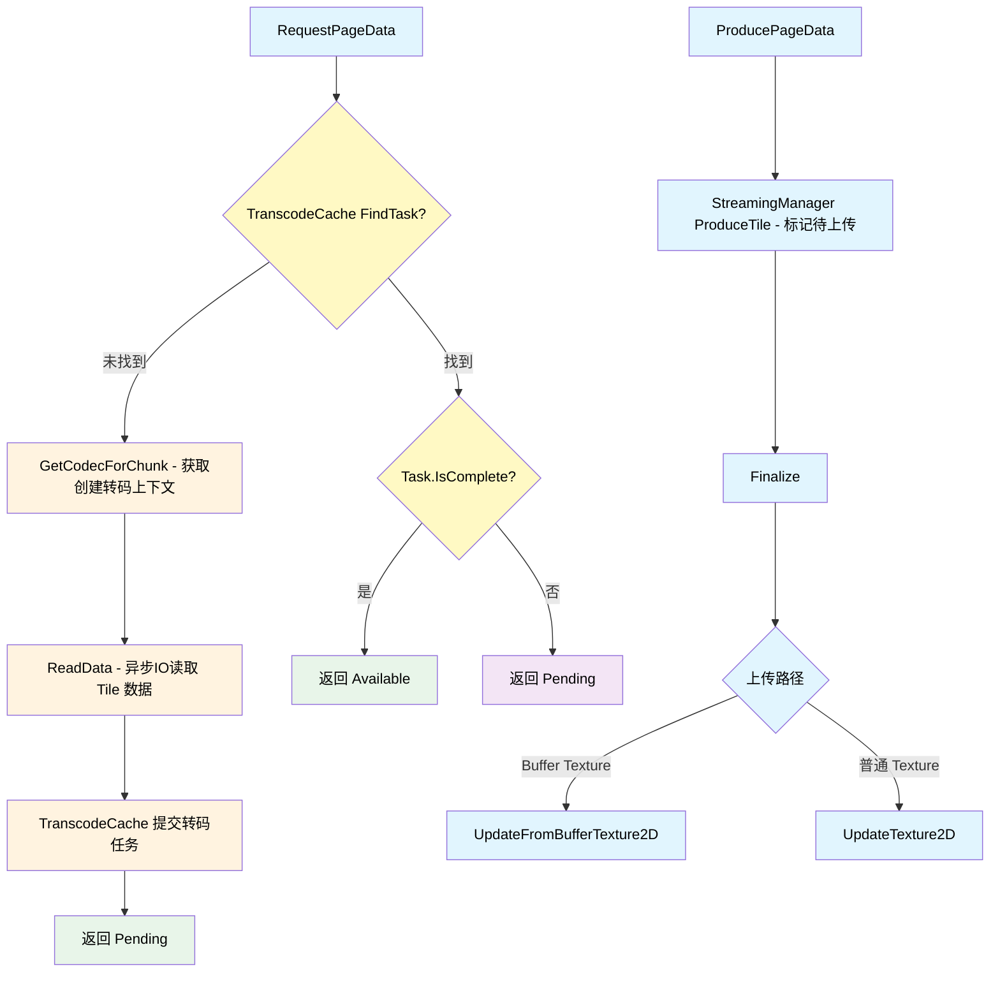
```mermaid
flowchart TD
    A["RequestPageData"] --> B{"TranscodeCache FindTask?"}
    B -->|"未找到"| C["GetCodecForChunk - 获取创建转码上下文"]
    C --> D["ReadData - 异步IO读取 Tile 数据"]
    D --> E["TranscodeCache 提交转码任务"]
    E --> F["返回 Pending"]
    B -->|"找到"| G{"Task.IsComplete?"}
    G -->|是| H["返回 Available"]
    G -->|否| I["返回 Pending"]

    J["ProducePageData"] --> K["StreamingManager ProduceTile - 标记待上传"]
    K --> L["Finalize"]
    L --> M{"上传路径"}
    M -->|"Buffer Texture"| N["UpdateFromBufferTexture2D"]
    M -->|"普通 Texture"| O["UpdateTexture2D"]

    classDef proc fill:#e1f5fe,color:#000
    classDef dec fill:#fff9c4,color:#000
    classDef ok fill:#e8f5e9,color:#000
    classDef data fill:#fff3e0,color:#000
    classDef out fill:#f3e5f5,color:#000
    class A,J,K,L proc
    class B,G dec
    class C,D,E data
    class F,H ok
    class I out
    class M,N,O proc
```

**关键数据结构**：

```cpp
// UploadingVirtualTexture.h
class FUploadingVirtualTexture : public IVirtualTexture
{
    FName Name;
    FVirtualTextureBuiltData* Data;           // 离线构建数据
    TArray<TUniquePtr<IFileCacheHandle>> HandlePerChunk;  // 文件句柄
    TArray<TUniquePtr<FVirtualTextureCodec>> CodecPerChunk; // 转码上下文
    TBitArray<> InvalidChunks;                // 加载失败的 Chunk
    int32 FirstMipOffset;                     // 跳过已移除的低 Mip
    FVirtualTextureChunkStreamingManager* StreamingManager;
};
```

**Codec 生命周期管理**：

- Codecs 懒创建，按使用频率淘汰
- CVar `r.VT.CodecAgeThreshold`（默认 120 帧）控制淘汰阈值
- CVar `r.VT.CodecNumThreshold`（默认 100）控制最大数量

### 8.5 FVirtualTextureBuiltData — 离线数据格式

**文件**：`Engine/Private/VT/VirtualTextureBuiltData.h`

```cpp
struct FVirtualTextureBuiltData
{
    uint32 NumLayers, NumMips;
    uint32 Width, Height, WidthInBlocks, HeightInBlocks;
    uint32 TileSize, TileBorderSize;
    EPixelFormat LayerTypes[8];
    FLinearColor LayerFallbackColor[8];

    TArray<FVirtualTextureDataChunk> Chunks;          // 分块存储
    TArray<FVirtualTextureTileOffsetData> TileOffsetData[8]; // 每层 Tile 偏移
};
```

Chunk 以 **Morton 序** 存储 Tile，配合稀疏偏移映射（`FVirtualTextureTileOffsetData`）实现按需加载。

---

## 9. Adaptive Virtual Texture

### 9.1 问题

标准 VT 的 PageTable 是完整的 mip 链，对于稀疏场景（如大面积地形只有少量区域有高细节），PageTable 本身的显存开销很大。

### 9.2 解决方案：网格化间接寻址

`FAdaptiveVirtualTexture`（`AdaptiveVirtualTexture.h/cpp`）将 UV 空间分成网格（Grid），每个 Grid 可以独立分配/释放 PageTable 空间：


```mermaid
flowchart TD
    subgraph AVT["Adaptive Page Table 间接寻址"]
        A["UV 坐标"] --> B["计算 Grid 坐标和 Grid 内偏移"]
        B --> C["读取 PageTableIndirection 获取 Grid 信息"]
        C --> D["解析 XOffsetInPages YOffsetInPages MaxLevel"]
        D --> E["计算 Grid 内 MipLevel 调整 dUVdxdy"]
        E --> F["查找实际 PageTable"]
    end

    classDef proc fill:#e1f5fe,color:#000
    classDef ok fill:#e8f5e9,color:#000
    class A,B,C,D,E proc
    class F ok
```

**Shader 端映射过程**（`ApplyAdaptivePageTableUniform`）：

1. 根据 UV 计算 Grid 坐标和 Grid 内偏移
2. 从 `PageTableIndirection` 纹理读取 Grid 信息：
   - `XOffsetInPages` / `YOffsetInPages`：Grid 在 PageTable 上的起始偏移
   - `MaxLevel`：该 Grid 可映射的最大 Mip 数
3. 计算 Grid 内部的相对 MipLevel，调整 dUVdxdy

**CPU 端还原**：

Adaptive 下的 `vPageLevel`、`PageX`、`PageY` 是 Grid 内部的坐标，需要还原到 Non-Adaptive 空间：

```
NonAdaptive_MipLevel = GridInternal_MipLevel + Grid_StartOffset
NonAdaptive_PageX = Grid_StartX + GridInternal_PageX
NonAdaptive_PageY = Grid_StartY + GridInternal_PageY
```

### 9.3 自适应分配队列

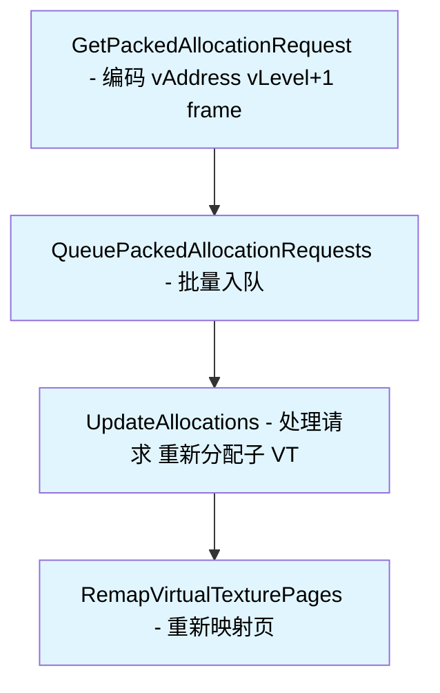
```mermaid
flowchart TD
    A["GetPackedAllocationRequest - 编码 vAddress vLevel+1 frame"] --> B["QueuePackedAllocationRequests - 批量入队"]
    B --> C["UpdateAllocations - 处理请求 重新分配子 VT"]
    C --> D["RemapVirtualTexturePages - 重新映射页"]

    classDef proc fill:#e1f5fe,color:#000
    class A,B,C,D proc
```

---

## 10. 脏页管理与持续更新

### 10.1 脏页追踪

`FRuntimeVirtualTextureSceneProxy::Dirty()` 将世界空间边界转换为 UV 空间脏矩形：

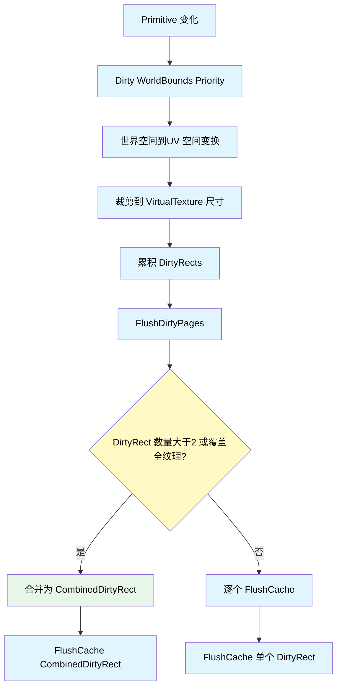
```mermaid
flowchart TD
    A["Primitive 变化"] --> B["Dirty WorldBounds Priority"]
    B --> C["世界空间到UV 空间变换"]
    C --> D["裁剪到 VirtualTexture 尺寸"]
    D --> E["累积 DirtyRects"]
    E --> F["FlushDirtyPages"]
    F --> G{"DirtyRect 数量大于2 或覆盖全纹理?"}
    G -->|是| H["合并为 CombinedDirtyRect"]
    G -->|否| I["逐个 FlushCache"]
    H --> J["FlushCache CombinedDirtyRect"]
    I --> K["FlushCache 单个 DirtyRect"]

    classDef proc fill:#e1f5fe,color:#000
    classDef dec fill:#fff9c4,color:#000
    classDef ok fill:#e8f5e9,color:#000
    class A,B,C,D,E,F,I,J,K proc
    class G dec
    class H ok
```

**关键**：`MaxDirtyLevel` 限制脏页刷新不触及 SVT 管理的低 Mip 区域。

### 10.2 持续更新

RVT 提供 `bContinuousUpdate` 选项解决纹理串流同步问题：

```cpp
// RuntimeVirtualTexture.h
UPROPERTY(EditAnywhere, AdvancedDisplay, Category = Layout,
    meta = (DisplayName = "Enable continuous page updates"))
bool bContinuousUpdate = false;
```

**应用场景**：LandscapeComponent 的 Heightmap 走 Texture Streaming，PIE 开头几帧还没流式加载完全，但 RVT 的 PageBake 已触发，导致 Page 使用低精度纹理渲染。开启后每帧 round-robin 刷新部分 Page，逐步修正。

**代价**：每帧刷几个 Page 性能开销不小。

### 10.3 请求来源汇总

除了 Feedback 驱动的请求，还有其他来源：

| 来源 | 函数 | 说明 |
|---|---|---|
| Feedback Buffer | `GatherFeedbackRequests` | GPU 回读的去重请求 |
| Locked Tiles | `GatherLockedTileRequests` | 被锁定的页（如最高 Mip） |
| Packed Requests | `GatherPackedTileRequests` | 主动填充的 Feedback |
| 脏页刷新 | `SubmitRequestsFromLocalTileRequests` | `FlushCache` 时的 LockedPages |
| 持续更新 | `ContinuousUpdateRequests` | 已映射页的周期性更新 |

---

## 11. Residency 与 Mip Bias 动态调节

`FVirtualTexturePhysicalSpace::UpdateResidencyTracking()` 动态调整 Mip 偏移以保持物理页池在预算内：

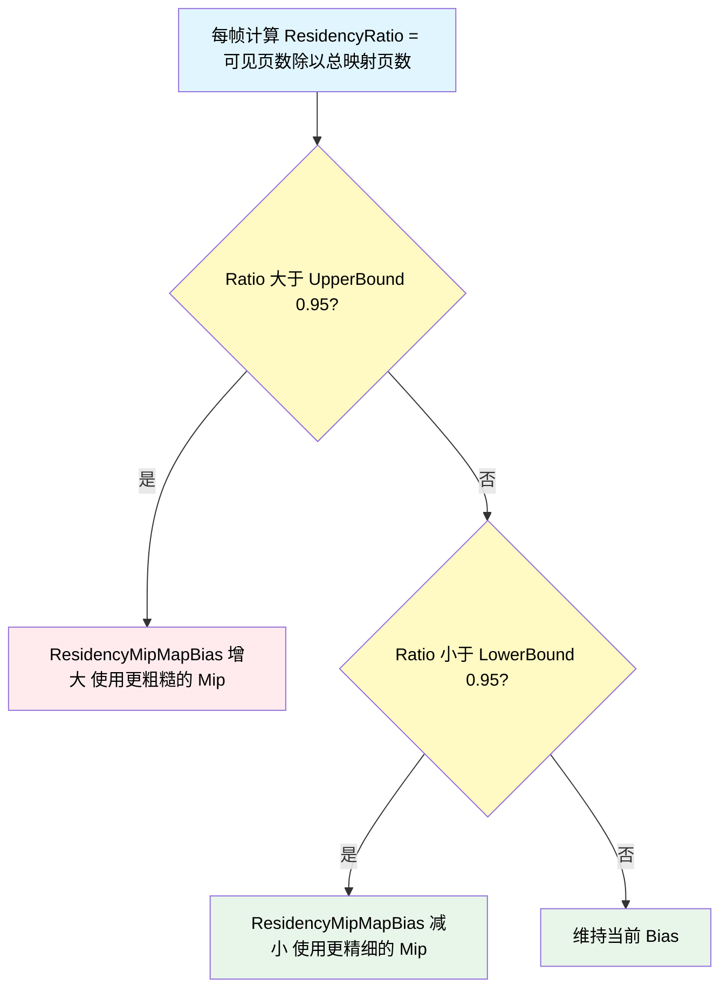
```mermaid
flowchart TD
    A["每帧计算 ResidencyRatio = 可见页数除以总映射页数"] --> B{"Ratio 大于 UpperBound 0.95?"}
    B -->|是| C["ResidencyMipMapBias 增大 使用更粗糙的 Mip"]
    B -->|否| D{"Ratio 小于 LowerBound 0.95?"}
    D -->|是| E["ResidencyMipMapBias 减小 使用更精细的 Mip"]
    D -->|否| F["维持当前 Bias"]

    classDef proc fill:#e1f5fe,color:#000
    classDef dec fill:#fff9c4,color:#000
    classDef err fill:#ffebee,color:#000
    classDef ok fill:#e8f5e9,color:#000
    class A proc
    class B,D dec
    class C err
    class E,F ok
```

**控制 CVar**：

| CVar | 默认值 | 说明 |
|---|---|---|
| `r.VT.Residency.UpperBound` | 0.95 | 超过此阈值增加 Bias |
| `r.VT.Residency.LowerBound` | 0.95 | 低于此阈值减少 Bias |
| `r.VT.Residency.AdjustmentRate` | 0.2 | 每帧变化率 |

---

## 12. 工程实践中的关键问题与解决方案

### 12.1 RVT 与 Texture Streaming 同步

**问题**：PIE 开头几帧 Heightmap 还没流式加载完，RVT BakePage 用了低精度纹理。

**方案**：开启 `bContinuousUpdate`，但性能开销大。

### 12.2 SVT Feedback 时机

**问题**：RVT BakePage 用到的 SVT 的 Feedback 只有 Bake 时才触发，不能依赖 SVT 采样的 Feedback。

**方案**：自己构建 Feedback（参考 `VirtualHeightfieldMeshSceneProxy` 模式）。

### 12.3 依赖的 SVT Page 被 LRU 淘汰

**问题**：GatherRequests 时检查 SVT Page 存在 → SubmitRequests 时该 Page 被 LRU 淘汰 → RVT Page 渲染错误。

**时序**：

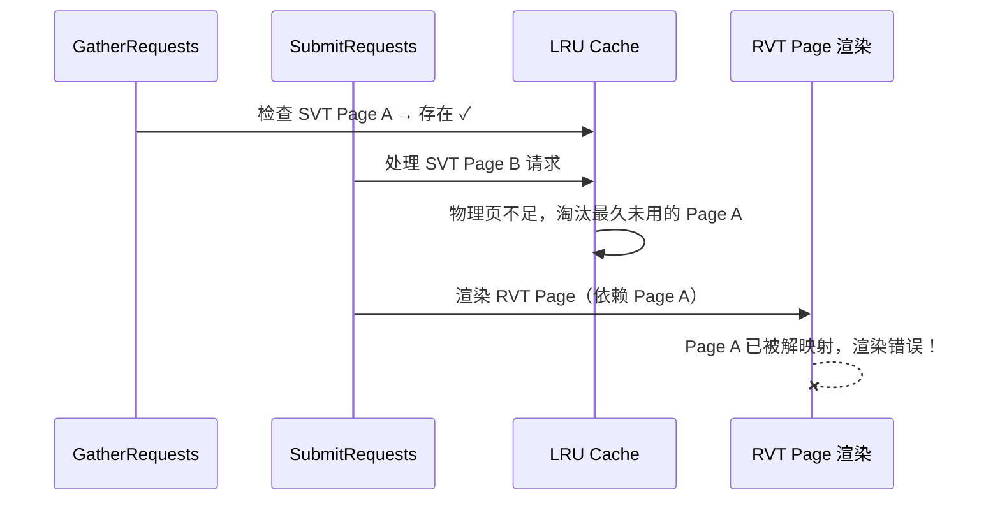
```mermaid
sequenceDiagram
    participant GR as GatherRequests
    participant SR as SubmitRequests
    participant LRU as LRU Cache
    participant RVT as RVT Page 渲染

    GR->>LRU: 检查 SVT Page A → 存在 ✓
    SR->>LRU: 处理 SVT Page B 请求
    LRU->>LRU: 物理页不足，淘汰最久未用的 Page A
    SR->>RVT: 渲染 RVT Page（依赖 Page A）
    RVT--xRVT: Page A 已被解映射，渲染错误！
```

**方案**：将 RVT Page 推到下一帧，下一帧 `GatherLockedTileRequests` 时重新申请依赖 Page。被依赖的 SVT Request 设为最高优先级。

### 12.4 材质参数变化导致 RVT 渲染错误

**问题**：调整材质参数后 RVT 出现无效 Tile。

**方案**：UE-main 2025年12月修复（[commit 98371484](https://github.com/EpicGames/UnrealEngine/commit/98371484ba8908325adfa1cef7f1e5c4a31821f0)），搬过来即可。

### 12.5 RVT Volume 与 IdSplatMap 对齐

**问题**：勾选 Snap To Landscape 后 Volume 会扩大到超出实际地表范围（如 4080m → 4096m），而 IdSplatMap 是整个地表 0-1 映射，导致两者无法对齐。

**方案**：**不要勾选 Snap To Landscape**。

### 12.6 SVT 用于渲染 RVT 的官方态度

截至 2025年10月，官方论坛仍不建议把 VT 的结果用于渲染 RVT，存在 SVT 没来得及及时更新的问题。

---

## 13. 依赖同步机制的工程实现

### 13.1 核心逻辑

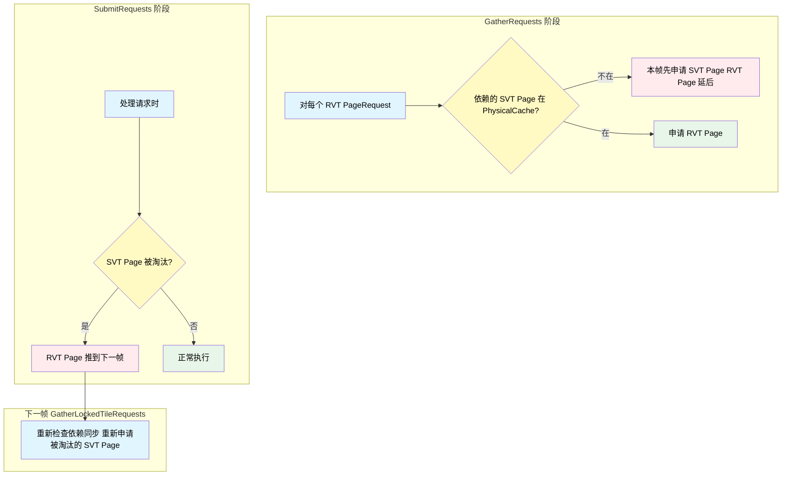
```mermaid
flowchart TD
    subgraph Gather["GatherRequests 阶段"]
        A["对每个 RVT PageRequest"] --> B{"依赖的 SVT Page 在 PhysicalCache?"}
        B -->|不在| C["本帧先申请 SVT Page RVT Page 延后"]
        B -->|在| D["申请 RVT Page"]
    end

    subgraph Submit["SubmitRequests 阶段"]
        E["处理请求时"] --> F{"SVT Page 被淘汰?"}
        F -->|是| G["RVT Page 推到下一帧"]
        F -->|否| H["正常执行"]
    end

    subgraph Next["下一帧 GatherLockedTileRequests"]
        I["重新检查依赖同步 重新申请被淘汰的 SVT Page"]
    end

    G --> I

    classDef proc fill:#e1f5fe,color:#000
    classDef dec fill:#fff9c4,color:#000
    classDef err fill:#ffebee,color:#000
    classDef ok fill:#e8f5e9,color:#000
    class A,E,I proc
    class B,F dec
    class C,G err
    class D,H ok
```

### 13.2 维护映射关系

由于某些阶段（`SubmitRequestsFromLocalTileRequests`、`SubmitRequest`、`GatherLockedTileRequests`）Request 已转换为 Producer 的 LocalTile，不好拿到对应的 AllocatedVT。需要维护：

```
ProducerHandle → AllocatedVT 映射 (ProducerHandleToAllocatedVTMap)
```

### 13.3 Locked Tile 的依赖同步

Lock 时机包括锁定 RVT 的最高一级 Mip 等。在 `GatherLockedTileRequests` 中也需要处理依赖同步判断。

### 13.4 处理 Pending 请求

每帧渲染的 Page 数量有限，一些 PageRequest 可能因条件被设为 Pending 或物理块不足而跳过。如果是 LockedTile，会放到下帧的 `LockedTileRequest`。

---

## 14. 完整数据流总图

```mermaid
flowchart TD
    subgraph GPU_Rend["GPU 渲染"]
        BP["BasePass PS"] -->|"TextureLoadVirtualPageTable"| PT["PageTable 纹理"]
        BP -->|"FinalizeVirtualTexturefeedback"| FB["FeedbackBuffer"]
    end

    subgraph Readback["GPU到CPU 回读"]
        FB -->|"FVirtualTextureFeedback Ring8 Fence"| CPU_FB["CPU 端 Feedback 数据"]
    end

    subgraph CPU_Req["CPU 请求构建"]
        CPU_FB -->|"GatherFeedbackRequests 并行去重"| UPL["FUniquePageList"]
        UPL -->|"GatherRequests 查找加LRU"| RL["FUniqueRequestList Load加Mapping"]
        LT["GatherLockedTileRequests"] --> RL
        PK["GatherPackedTileRequests"] --> RL
    end

    subgraph Exec["请求执行"]
        RL -->|"SubmitRequests"| SR["遍历 PageRequest"]
        SR -->|"RequestPageData"| RVT_P["RVT 返回 Available"]
        SR -->|"RequestPageData"| SVT_P["SVT 返回 Pending或Available"]
        RVT_P -->|"ProducePageData"| FIN["IVirtualTextureFinalizer"]
        SVT_P -->|"ProducePageData"| FIN
    end

    subgraph SVT_Load["SVT 异步加载"]
        SVT_P -->|"RequestTile"| IO["异步IO加转码"]
        IO -->|"TranscodeCache"| UP["UploadCache"]
        UP -->|"UpdateTexture2D"| PHY["PhysicalCache"]
    end

    subgraph RVT_Rend["RVT 实时渲染"]
        FIN -->|"RenderFinalize"| RP["RenderPageBatch"]
        RP -->|"材质渲染"| RT["临时 RT"]
        RT -->|"Compute压缩 BC或ETC2"| CP["压缩后数据"]
        CP -->|"CopyPage"| PHY
    end

    subgraph PT_Update["PageTable 更新"]
        PHY -->|"FinalizeRequests"| PTU["批量更新 PageTable"]
        PTU --> PT
    end

    classDef proc fill:#e1f5fe,color:#000
    classDef data fill:#fff3e0,color:#000
    classDef ok fill:#e8f5e9,color:#000
    classDef out fill:#f3e5f5,color:#000
    class BP,PT,FB,CPU_FB data
    class UPL,RL,LT,PK,SR proc
    class RVT_P ok
    class SVT_P,IO,UP data
    class FIN out
    class RP,RT,CP,PTU proc
    class PHY out
```

---

## 15. 关键常量与限制速查

| 参数 | 值 | 来源 |
|---|---|---|
| 最大 VT 地址空间 | 4096×4096 页 | `VIRTUALTEXTURE_MAX_PAGETABLE_SIZE` |
| 最大 PageTable Mip | 12 | log2(4096) + 1 |
| 虚拟 Tile 尺寸 | 64/128/256/512px | 可配置 |
| Tile Border | 4px | 双线性过滤 |
| 最大物理页数 | 65535 | 16-bit 寻址 |
| 每物理空间最大层数 | 4 | R/G/B/A |
| 最大唯一页 | 8K | `FUniquePageList` |
| 最大 Load 请求/帧 | 4K | `FUniqueRequestList` |
| 最大 Mapping 请求/帧 | ~7.75K | `FUniqueRequestList` |
| Feedback Buffer 延迟 | ~3 帧 | `GVirtualTextureFeedbackLatency` |
| Feedback Ring Buffer | 8 个 pending 传输 | `FVirtualTextureFeedback` |
| Codec 淘汰阈值 | 120 帧 | `r.VT.CodecAgeThreshold` |
| 最大 Codec 数 | 100 | `r.VT.CodecNumThreshold` |

---

## 16. 源码文件索引

| 文件 | 职责 |
|---|---|
| `VirtualTextureSystem.h/cpp` | 主协调器，每帧管线 |
| `VirtualTextureSpace.h/cpp` | 虚拟地址空间，PageTable 纹理 |
| `VirtualTexturePhysicalSpace.h/cpp` | 物理页池管理，Residency 追踪 |
| `TexturePageMap.h/cpp` | Virtual→Physical 映射 |
| `TexturePagePool.h/cpp` | 物理页分配，LRU 堆，淘汰 |
| `VirtualTextureFeedback.h/cpp` | GPU→CPU Feedback 回读管线 |
| `UniquePageList.h` | Feedback 去重 |
| `UniqueRequestList.h` | 请求合并、优先级排序 |
| `VirtualTextureProducer.h/cpp` | Producer 接口与集合 |
| `RuntimeVirtualTextureProducer.h/cpp` | RVT Producer 实现 |
| `RuntimeVirtualTextureRender.cpp` | RVT Page 渲染、压缩、Copy |
| `RuntimeVirtualTextureSceneProxy.h/cpp` | RVT 场景代理，脏页管理 |
| `RuntimeVirtualTextureSceneExtension.h/cpp` | RVT Primitive 追踪 |
| `AdaptiveVirtualTexture.h/cpp` | 网格化自适应 PageTable |
| `VirtualTextureAllocator.h/cpp` | 四叉树地址空间分配 |
| `AllocatedVirtualTexture.h/cpp` | 已分配 VT 表示 |
| `TexturePageLocks.h/cpp` | Page 锁定管理 |
| `Engine/.../UploadingVirtualTexture.h/cpp` | SVT 流式加载 Producer |
| `Engine/.../VirtualTextureLevelRedirector.h/cpp` | Mip 层级重定向 |
| `Engine/.../VirtualTextureChunkManager.h/cpp` | SVT Chunk 流式管理 |
| `Engine/.../VirtualTextureBuiltData.h/cpp` | 离线构建数据格式 |
| `Engine/.../RuntimeVirtualTexture.h/cpp` | RVT UObject 与 RenderResource |
| `Engine/.../VirtualTextureBuilder.h/cpp` | SVT 构建器 UObject |
| `Engine/.../VirtualTextureDataBuilder.h/cpp` | 离线数据处理 |

---

## 参考

- UE 源码 `Engine/Source/Runtime/Renderer/Private/VT/`
- UE 源码 `Engine/Source/Runtime/Engine/Private/VT/`
- UE 源码 `Engine/Source/Runtime/RenderCore/Public/VirtualTexturing.h`
- [UE Forum: RVT showing invalid tiles on terrain after material parameter change](https://forums.unrealengine.com/t/rvt-showing-invalid-tiles-on-terrain-after-material-parameter-change/2664546/6)
- [UE Forum: Runtime Virtual Texture sets landscape to lower mip](https://forums.unrealengine.com/t/runtime-virtual-texture-sets-landscape-to-lower-mip/154882/36)
- [EpicGames/UnrealEngine commit 98371484](https://github.com/EpicGames/UnrealEngine/commit/98371484ba8908325adfa1cef7f1e5c4a31821f0)
